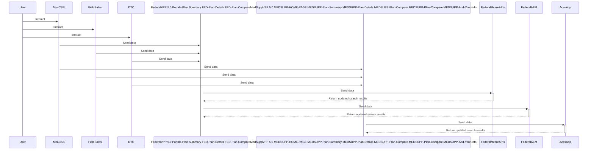

# Medsupp VPP

---

## **Overview:**

Provides the consumer to Shop and View Medicare Supplement Plans.

---

### Architecture and Components

---

#### Sequence Diagrams

### Database

---

#### Stage EndPoints

---

| EndPoint | URL |
| --- | --- |
|`msApiEndpointUrlV2`|<https://gateway-stage.optum.com>|
|`msPlanStartDateApiEndpointUriV2`|/api/stg/ben/plan/ace-plans/v2/zip-codes/{zipcode}/products/MEDSUPP/plan-start-dates/search?channel=DTC|
|`msSearchPlanApiEndpointUriV2`|/api/stg/ben/plan/ace-plans/v2/zip-codes/{zipcode}/products/MEDSUPP/plans/search|
|`msSearchPlanVasApiEndpointUriV2`|/api/stg/ben/plan/ace-plans/v2/states/{statecode}/products/MEDSUPP/plans/{plancode}|
|`msSearchZipcodeApiEndpointUriV2`|/api/stg/ben/plan/ace-plans/v2/zip-codes/{zipcode}/states|

#### Prod EndPoints

---

| EndPoint | URL |
| --- | --- |
|`msApiEndpointUrlV2`|<https://gateway.optum.com>|
|`msPlanStartDateApiEndpointUriV2`|/api/ben/plan/ace-plans/v2/zip-codes/{zipcode}/products/MEDSUPP/plan-start-dates/search?channel=DTC|
|`msSearchPlanApiEndpointUriV2`|/api/ben/plan/ace-plans/v2/zip-codes/{zipcode}/products/MEDSUPP/plans/search|
|`msSearchPlanVasApiEndpointUriV2`|/api/ben/plan/ace-plans/v2/states/{statecode}/products/MEDSUPP/plans/{plancode}|
|`msSearchZipcodeApiEndpointUriV2`|/api/ben/plan/ace-plans/v2/zip-codes/{zipcode}/states|

---

| EndPoint | URL |
| --- | --- |
| `Team EndPoint`| <https://medsupp-api-team-1.team.gpd-acq-azure.optum.com/medsupp-api> |
| `QA EndPoint` |  <https://medsupp-api-qa-1.qa.gpd-acq-azure.optum.com/medsupp-api>|
| `Stage1 EndPoint` | <https://medsupp-api-stage-1.stage.gpd-acq-azure.optum.com/medsupp-api>|
| `Stage2 EndPoint` |<https://medsupp-api-stage-2.stage.gpd-acq-azure.optum.com/medsupp-api>|
| `Prod1 EndPoint` | <https://medsupp-api-prod-1.prod.gpd-acq-azure.optum.com/medsupp-api>|
| `Prod2 EndPoint` |<https://medsupp-api-prod-2.prod.gpd-acq-azure.optum.com/medsupp-api>|

#### Medsupp API services

---

| EndPoint | URL                                                                                                 |Purpose|
| --- | --- | --- |
|`GET`|/medsupp/plans/v2/custom/zipcode/{zipcode}/statecode/{statecode}/asOfDate/{asOfDate}/products/MEDSUPP/data|PRE Team|
|`GET`|/medsupp/plans/v2/custom/zipcode/{zipcode}/products/MEDSUPP/search|PRE Team|
|`GET`|/medsupp/plans/v2/zip-codes/{zipcode}/states|State Info related to MEDSUPP Plan|
|`GET`|/medsupp/plans/v2/states/{statecode}/products/MEDSUPP/plans/{plancode}|Details for specific state,MEDSUPP plan|
|`GET`|/medsupp/plans/v2/zip-codes/{zipcode}/products/MEDSUPP/search|List of MEDSUPP marketable plans|
|`POST`|/medsupp/plans/v2/zip-codes/{zipcode}/products/MEDSUPP/search|List of MEDSUPP marketable plans|
|`POST`|/medsupp/plans/v2/zip-codes/{zipcode}/plan-start-dates/search|Provides set of MEDSUPP plan start dates|

---

#### ACES End Point

| EndPoint | URL |
| --- | --- |
| `ACES End Points`| <https://uhgazure.sharepoint.com/teams/GPDigitalExperiencesandInitiatives/Shared%20Documents/Forms/AllItems.aspx?newTargetListUrl=%2Fteams%2FGPDigitalExperiencesandInitiatives%2FShared%20Documents&viewpath=%2Fteams%2FGPDigitalExperiencesandInitiatives%2FShared%20Documents%2FForms%2FAllItems%2Easpx&id=%2Fteams%2FGPDigitalExperiencesandInitiatives%2FShared%20Documents%2F%60%20Med%20Supp%20Team%2F4%2E%20Dark%20Knights%20Scrum%20Team%2FTechnical%20Documentation%2FMS%20Endpoint%2FACESEndPoints&viewid=93572ef5%2D22ee%2D4502%2Daa71%2D79d9b89a9229>|
|`Medsupp Service End points`| <https://uhgazure.sharepoint.com/teams/GPDigitalExperiencesandInitiatives/Shared%20Documents/Forms/AllItems.aspx?newTargetListUrl=%2Fteams%2FGPDigitalExperiencesandInitiatives%2FShared%20Documents&viewpath=%2Fteams%2FGPDigitalExperiencesandInitiatives%2FShared%20Documents%2FForms%2FAllItems%2Easpx&id=%2Fteams%2FGPDigitalExperiencesandInitiatives%2FShared%20Documents%2F%60%20Med%20Supp%20Team%2F4%2E%20Dark%20Knights%20Scrum%20Team%2FTechnical%20Documentation%2FMS%20Endpoint%2FMedsuppWrapperEndPoints&viewid=93572ef5%2D22ee%2D4502%2Daa71%2D79d9b89a9229>|

#### Important URLs

---

Jenkins job to clear data cache for medsupp plan summary, medsupp plan details, medsupp plan compare

| EndPoint | URL |
| --- | --- |
| `Redis Cache Clear` | <https://gpd-ops-portals.optum.com/job/4.0%20-%20GitOps/job/gp-digital-redis-cache/>|

---

### Deployment and Configuration

| Jobs | Configuration |
| --- | --- |
| `CI/CD  Jobs` | <https://gpd-build-portals.optum.com/job/build>

---

#### Helm Configuration

| Jobs | Configuration |
| --- | --- |
| `plan-summary.`| <https://github.com/uhc-tech-medicare-retiree-common/gpd-common-tools-medsupp-plan-summary-helm-chart>|
| `plan-details` | <https://github.com/uhc-tech-medicare-retiree-common/gpd-common-tools-vpp-plan-details-helm-chart>|
| `plan-compare` | <https://github.com/uhc-tech-medicare-retiree-common/gpd-common-tools-medsupp-plan-compare-helm-chart>|

---

#### Terraform Configuration

| Jobs | Configuration |
| --- | --- |
| `plan-summary` | <https://github.com/uhc-tech-medicare-retiree-common/gpd-common-tools-medsupp-plan-summary-apim-tf> |
| `plan-details` | <https://github.com/uhc-tech-medicare-retiree-common/gpd-common-tools-medsupp-plan-details-apim-tf> |
| `plancompare` | <https://github.com/uhc-tech-medicare-retiree-common/gpd-common-tools-medsupp-plan-compare-apim-tf> |

---

#### Node Cache Clear

| Job | Configuration |
| --- | --- |
|`Stage Job`|<https://gpd-ops-portals.optum.com/job/4.0%20-%20GitOps/job/stage-node-cache-clear/build?delay=0sec>|

---

#### Appendix

| Repo | Git Hub |
| --- | --- |
| `plan-summary`| <https://github.com/uhc-tech-medicare-retiree-common/gpd-common-tools-medsupp-plan-summary> |
| `plan-details`| <https://github.com/uhc-tech-medicare-retiree-common/gpd-common-tools-medsupp-plan-details> |
| `plancompare`| <https://github.com/uhc-tech-medicare-retiree-common/gpd-common-tools-medsupp-plan-compare>|
| `shopper-proflle-medsuppui`|<https://github.com/uhc-tech-medicare-retiree-common/gpd-shopper-profile-medsupp-ui>|

---
